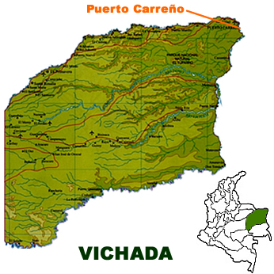

```{r setup, include=FALSE}
library(tufte)
library(kableExtra)
library(ggplot2)
library(knitr)

# invalidate cache when the tufte version changes
knitr::opts_chunk$set(cache.extra = packageVersion('tufte'))
options(htmltools.dir.version = FALSE)

tab_summary_cuanti<-readRDS(file = "tab_summary_cuanti.rsd")
caja <- readRDS(file="caja.rds")
tabla_medias<-readRDS(file = "tabla_medias.rsd")
matriz_cov<-readRDS(file = "matriz_cov.rsd")
matriz_cor<-readRDS(file = "matriz_cor.rsd")
tabla_var_glob<-readRDS(file = "tabla_var_glob.rsd")
disp <- readRDS(file="disp.rds")
maha <- readRDS(file="maha.rds")
tabla_asi_kur<-readRDS(file = "tabla_asi_kur.rsd")
tab_norm<-readRDS(file = "tab_norm.rsd")
tab_mul<-readRDS(file = "tab_mul.rsd")
chi_plot <- readRDS(file="chi_plot.rds")
#variables cualitativas
tb1_ET_TEN<-readRDS(file = "tb1_ET_TEN.rds")
grafico_1<- readRDS(file="grafico_1.rds")
tb2_ET_FEN<-readRDS(file = "tb2_ET_FEN.rds")
grafico_2<- readRDS(file="grafico_2.rds")
tb3_PAS_ET<-readRDS(file = "tb3_PAS_ET.rds")
grafico_3<- readRDS(file="grafico_3.rds")
tb4_TEN_FEN_1<-readRDS(file = "tb4_TEN_FEN_1.rds")
tb4_TEN_FEN_2<-readRDS(file = "tb4_TEN_FEN_2.rds")
grafico_4<- readRDS(file="grafico_4.rds")
tb5_PAS_TEN<-readRDS(file = "tb5_PAS_TEN.rds")
grafico_5<- readRDS(file="grafico_5.rds")
tb6_FEN_PAS<-readRDS(file = "tb6_FEN_PAS.rds")
grafico_6<- readRDS(file="grafico_6.rds")
per_c<- readRDS(file="per_c.rds")
per_f<- readRDS(file="per_f.rds")
resumen_aso<- readRDS(file="resumen_aso.rds")


```


\begin{center}
\LARGE\textbf{Análisis exploratorio de datos Departamento del Vichada}
\end{center}

# Introducción

\begin{justify}
Este informe presenta un análisis exploratorio de los datos del Censo Nacional Agropecuario (CNA) para el departamento del Vichada, con el objetivo de ofrecer una visión general de las principales características del sector agropecuario en esta región. 

```{r mapa-vichada, fig.margin=TRUE, fig.cap="Mapa del departamento del Vichada.", out.width="80%", echo=FALSE}


```
A través de un recorrido por variables claves como   área de pastos, cantidad de leche recolectada, área total de la UPA y algunas predominancias étnicas y de tenencia del terreno, se busca identificar patrones, contrastes y particularidades que permitan una mejor comprensión del contexto rural del departamento. Inicialmente, la base de datos contenía un total de 5,562 registros. Sin embargo, tras un análisis exploratorio, se identificaron datos faltantes, lo que requirió un proceso de depuración. Como resultado, la base de datos se redujo a 1,062 registros. Este análisis constituye un insumo preliminar para investigaciones más profundas sobre el departamento.

\end{justify}

# Selección de variables

Dentro de los datos recopilados por el CNA, se estudió específicamente la categoría “Unidad Productora”, que contiene información sobre unidades productoras agropecuarias (UPA), así como uso del suelo, área y tenencia de la tierra.Se seleccionaron 9 variables para el análisis en el departamento del Vichada. Tomando las siguientes variables cuantitativas como variables de estudio:
- Área de pastos  
- Número de hembras  
- Cantidad de leche recolectada  
- Área total de la UPA  
- Número de personas en el predio

Por otra parte, las variables cualitativas a estudiar son las siguientes:
- Predominancia étnica  
- Predominancia tenencia UPA  
- Fenómeno que afectó los pastos sembrados  
- Pastos o Sábanas

# Análisis de las variables cualitativas
A continuación, se muestra la tabla de resumen estadístico de las variables cuantitativas.
\vspace{0,5 cm}
```{r, warning=FALSE, message=FALSE, echo=FALSE}
knitr::kable(tab_summary_cuanti, format = "latex", booktabs = TRUE)
```
# Boxplot de cada variable cuantitativa.

```{r caja, fig.width = 8, fig.height = 6, fig.fullwidth = TRUE, warning=FALSE, message=FALSE, cache=TRUE, echo=FALSE}
caja
```
\begin{justify}
\textbf{Área de pastos:} Se observa una gran dispersión en los datos, con valores mínimos cercanos a 0 y un valor máximo que supera los 345 millones de metros, lo que indica la presencia de valores atípicos extremos. La mediana es de 2,1 millones, y el rango intercuartílico también es amplio. Esto sugiere que, aunque la mayoría de las UPA tienen áreas moderadas, algunas pocas poseen extensiones enormes que distorsionan el promedio.

\textbf{Número de hembras:} El valor mínimo es 0 y el máximo es 896, con una media de 32,46 y una mediana de 8,5. La asimetría positiva es evidente, muchas UPA tienen pocas hembras y unas pocas concentran un número mucho mayor, lo que puede relacionarse con el tamaño o tipo de explotación ganadera.

\textbf{Producción de leche:} Al igual que el número de hembras, esta variable muestra una fuerte asimetría. La mediana es de 30 litros, mientras que el promedio se eleva hasta 112,9 litros, con un máximo de 7136 litros. Esto indica que hay explotaciones con producciones significativamente mayores que el resto.

\textbf{Área total de la UPA:} Esta variable también evidencia una gran heterogeneidad. La mediana es de 4,6 millones de hectáreas, pero el promedio es de 11,2 millones y el máximo se eleva a 435 millones, confirmando la existencia de valores extremos que influyen en las medidas de tendencia central.

\textbf{Número de personas en el predio:} La mayoría de las unidades tienen entre 2 y 5 personas, con un promedio de 3,64. No obstante, hay predios con hasta 28 personas, lo que puede indicar estructuras familiares amplias o presencia de trabajadores permanentes.

\end{justify}
# Vector de medias
\begin{justify}
Con el fin de profundizar en el estudio, se analizaron los vectores de medias de las variables cuantitativas. Este enfoque permitió obtener una visión más precisa sobre el comportamiento de la distribución y las características centrales de los datos.

```{r, results='asis', echo=FALSE}
tabla_medias_tex <- knitr::kable(tabla_medias, format = "latex", booktabs = TRUE)
cat("\\begin{marginfigure}\n", tabla_medias_tex, "\n\\end{marginfigure}")
```
\vspace{0.2 cm}
Los resultados del vector de medias muestran que en promedio, el área de pastos por unidad productiva asciende a 6.913.700 hectáreas, lo cual refleja la gran extensión de terreno dedicada a esta actividad en el departamento del Vichada. En cuanto a la producción ganadera, se observan en promedio 32 hembras por unidad y una recolección de aproximadamente 113 litros de leche, esto sugiere un nivel de producción moderado que podría responder a sistemas extensivos de producción. Por su parte, el área total promedio de las unidades productivas es de 11.235.471 metros, reforzando la tendencia a la alta disponibilidad de tierra. Finalmente, el número promedio de personas por predio es de 3,64, lo que da una idea sobre la mano de obra disponible en cada unidad productiva.
\end{justify}

# Matriz de varianzas y correlaciones

```{r, warning=FALSE, message=FALSE, echo=FALSE}
knitr::kable(round(matriz_cov,4), format = "latex", booktabs = TRUE)
```

\begin{justify}
Se observa que las variables área pastos  y área total presentan las varianzas más altas, esto  indica una gran variabilidad entre las observaciones de estas dimensiones territoriales. En contraste, la variable Número de personas tiene la varianza más baja , lo que sugiere que es una de las variables más homogéneas en el conjunto de datos.

En cuanto a las covarianzas, los valores positivos indican que existe una relación directa entre las variables. Por ejemplo, la fuerte covarianza entre área pastos y área total  muestra que a mayor cantidad de área en pastos, suele haber también una mayor área total de la unidad productiva. De igual forma, variables como Producción de leche y Número de hembras presentan una covarianza positiva , evidenciando la siguiente relación: a mayor número de hembras, es probable que se recolecte más leche.

Finalmente, aunque algunas covarianzas como las que incluyen el Número de personas son positivas, sus magnitudes son relativamente pequeñas en comparación con otras variables, esto apunta a relación menos marcada con las demás unidades productivas.
\end{justify}

# Matriz de correlaciones

```{r, warning=FALSE, message=FALSE, echo=FALSE}
knitr::kable(matriz_cor, format = "latex", booktabs = TRUE)
```
\begin{justify}
En los resultados observamos una fuerte correlación positiva entre:

Área pastos y área total, indica que las unidades productivas con mayor superficie total también tienden a tener una mayor extensión dedicada a pastos. Número de hembras y producción de leche, ya que más hembras suelen traducirse en mayor producción de leche.

El área total respecto al número de hembras y producción de leche tiene una correlación de intensidad moderada, igualmente el área de pastos y el número de hembras; estas asociaciones sugieren que aunque hay cierta relación, no es determinante entre estas variables.

Finalmente, el número de personas en el predio muestra correlaciones muy bajas con el resto de variables, como con área total o producción de leche, lo que indica que el tamaño del grupo humano residente no está fuertemente relacionado con las dimensiones físicas o productivas de la unidad agropecuaria.

\end{justify}

# Dispersograma

\begin{justify}
Se evidencian asociaciones fuertes como la existente entre el área de pastos y el área total, con una alineación clara que respalda la alta correlación observada. 
```{r disp, fig.margin=TRUE, out.width="120%", echo=FALSE}
disp
```
En contraste, variables como el número de personas en el predio no muestran una relación aparente con el resto de variables, lo que concuerda con sus bajos coeficientes de correlación. Además, es posible identificar valores atípicos, especialmente en variables como la producción de leche y área total, que presentan puntos significativamente alejados del resto.
\end{justify}

# Medidas globales de variabilidad

\begin{justify}
A continuación se describen las principales conclusiones derivadas de cada estadístico:
```{r, results='asis', echo=FALSE}
tabla_var_glob <- knitr::kable(tabla_var_glob, format = "latex", booktabs = TRUE)
cat("\\begin{marginfigure}\n", tabla_var_glob, "\n\\end{marginfigure}")
```
\textbf{Varianza total}: Un valor elevado como el obtenido refleja una alta variabilidad global entre las observaciones.

\textbf{Varianza promedio}: Sugiere que, en promedio, cada variable presenta una alta dispersión.

\textbf{Varianza generalizada}: Un valor tan elevado confirma la existencia de una considerable dispersión multivariada.

\textbf{Desviación típica generalizada}:Refuerza la conclusión anterior sobre la magnitud de la variabilidad global.

\textbf{Variabilidad promedio}: Da una medida más interpretable de la variabilidad promedio entre variables.

\textbf{Desviación promedio}: Este valor también respalda la existencia de una dispersión notable en el conjunto de datos.

\end{justify}


# Distancia Mahalanobis

\begin{justify}

La distancia de Mahalanobis permite medir cuán lejos se encuentra cada datos con respecto al centro multivariado de los datos, considerando no solo la media de cada variable, sino también las correlaciones entre ellas. 
```{r mahabis, fig.margin=TRUE, out.width="120%", echo=FALSE}

maha
```
Valores notablemente altos en esta medida pueden ser indicativos de datos atípicos, los cuales podrían requerir un análisis más detallado para evaluar su posible influencia o relevancia dentro del estudio.

Del gráfico anterior se puede apreciar que la mayoría de los datos tienen una distancia cercana a cero. Sin embargo, destacan dos distancias significativas: una se encuentra en el dato 400, con una distancia de 700, y la otra en el dato 235, con una distancia de Mahalanobis de 450. Estos valores indican que estas observaciones están notablemente distantes de la media, lo que indica que podrían ser posibles outliers o valores atípicos en el conjunto de datos.
\end{justify}

# Coeficiente de asimetría y curtosis


\begin{justify}

```{r, results='asis', echo=FALSE}
tabla_asi_kur <- knitr::kable(tabla_asi_kur, format = "latex", booktabs = TRUE)
cat("\\begin{marginfigure}\n", tabla_asi_kur, "\n\\end{marginfigure}")
```

Los valores obtenidos son considerablemente altos, lo cual muestra que el conjunto de variables cuantitativas analizadas presenta una distribución alejada de la normalidad multivariada. En particular, la alta asimetría multivariada indica que los datos tienden a estar más concentrados en ciertas regiones del espacio, con colas largas o una fuerte inclinación hacia alguno de los extremos.

Por otro lado, la kurtosis multivariada elevada implica la presencia de valores extremos o picos más pronunciados que los esperados bajo una distribución normal multivariada.

\end{justify}

# Prueba de multinormalidad

Caso univariado
\vspace{0.3 cm}
```{r, warning=FALSE, message=FALSE, echo=FALSE}
knitr::kable(tab_norm, format = "latex", booktabs = TRUE)
```
\vspace{0.2 cm}
\begin{justify}
En base a los resultados de la prueba de Lilliefors para la normalidad univariada de las variables cuantitativas, se concluye que todas las variables presentan un p-valor menor a 0.001, por lo tanto rechazamos la hipótesis nula de normalidad en cada una de ellas. Es decir, ninguna de las variables sigue una distribución normal.
\end{justify}

Caso de multinormalidad
\vspace{0.3 cm}
```{r, results='asis', echo=FALSE}
knitr::kable(tab_mul, format = "latex", booktabs = TRUE)
```
\begin{justify}

La prueba de Mardia para asimetría (skewness) y curtosis (kurtosis) proporciona las estadísticas y los valores p que evalúan si la distribución conjunta de todas las variables es multivariada normal. 

\textbf{Mardia skewness}: El valor de la estadística es 94,302.38 y el valor p es 0, lo que indica que hay una asimetría significativa en las variables. Esto sugiere que las variables no siguen una distribución normal multivariada debido a la presencia de asimetría.

\textbf{Mardia Kurtosis}: El valor de la estadística es 1,523.80 y el valor p es 0, lo que también indica una curtosis significativa. Por lo tanto, la distribución tiene colas más pesadas o más ligeras de lo esperado en una distribución normal multivariada.

\textbf{MVN (Multivariate Normality)}: La prueba MVN no pudo ser realizada (NA) debido a que las estadísticas de Mardia Skewness y Mardia Kurtosis mostraron que los datos no siguen una distribución normal multivariada.
\end{justify}

\begin{justify}
Además de las pruebas estadísticas, también se utiliza el siguiente gráfico para visualizar la normalidad de nuestras variables.

El gráfico Chi-cuadrado compara las distancias de Mahalanobis ordenadas con los cuantiles teóricos de una distribución Chi-cuadrado con p=5 grados de libertad, correspondientes a las cinco variables cuantitativas analizadas.
```{r chi-square, fig.margin=TRUE, out.width="130%", echo=FALSE}

chi_plot
```
En nuestro caso, se observa que muchos puntos se alejan notablemente de la línea, especialmente en la parte superior derecha del gráfico, lo cual sugiere la posible presencia de valores atípicos y desviaciones de la normalidad multivariada. Este patrón refuerza los resultados obtenidos previamente en las pruebas de normalidad univariada y multivariada (como Mardia), donde se rechazó la hipótesis de normalidad.
\end{justify}

# Análisis para las variables cualitativas.

\begin{center}
\textbf{Predominancia Étnica vs. Tenencia Predominante}
\end{center}
```{r, warning=FALSE, message=FALSE, echo=FALSE}
knitr::kable(tb1_ET_TEN, format = "latex", booktabs = TRUE)
```
\newpage

\justify
La tenencia propia es la forma más frecuente, representando el 70.4% de los casos, de los cuales 721 (67.9%) pertenecen a unidades productivas sin predominancia étnica definida (Ninguno), y 16 (1.5%) están asociadas a predios con predominancia en asentamientos indígenas.

```{r heat1, fig.margin=TRUE, out.width="130%", echo=FALSE}
grafico_1
```

\justify
La tenencia colectiva, por su parte, se presenta en 153 casos (14.4%), siendo más frecuente en unidades productivas con predominancia Asentamientos indígenas (7.3%) y Ninguno (5.5%). Es destacable que categorías como invación, mixta y usufructo representan proporciones insignificantes en el total (menos del 0.2% cada una). Finalmente, las categorías “Territorios sin titulación” y “Registro indígena” representan una baja proporción en el total, indicando posiblemente una menor formalización o presencia de estos tipos de tenencia en el departamento del Vichada.

\begin{center}
\textbf{Predominancia Étnica vs. Fenómenos}
\end{center}
```{r, warning=FALSE, message=FALSE, echo=FALSE}
knitr::kable(tb2_ET_FEN, format = "latex", booktabs = TRUE)
```
\vspace{0.5cm}
Las afectaciones más frecuentes fueron por sequía (41.8%) y "no afectados" (46.1%). Estos dos grupos concentran cerca del 88% de las observaciones, lo que sugiere una alta proporción de UPA que no reportan afectación o que han sido impactadas por la falta de lluvias.

```{r heat2, fig.margin=TRUE, out.width="130%", echo=FALSE}
grafico_2
```
\vspace{0.5 cm}
La sequía impactó principalmente a predios sin predominancia étnica, representando el 40% del total. Plagas afectan al 5% de las UPA, con una concentración en predios sin predominancia étnica (4.1%). Otros fenómenos como inundaciones (2.2%), incendios (2.6%) y exceso de lluvia (0.8%) muestran proporciones menores, con distribución más dispersa entre las categorías étnicas. Fenómenos menos comunes como heladas, granizadas, lluvia destructiva y vientos fuertes representan en conjunto menos del 1% del total.

\begin{center}
\textbf{Predominancia Étnica vs. Pastos}
\end{center}
```{r, warning=FALSE, message=FALSE, echo=FALSE}
knitr::kable(tb3_PAS_ET, format = "latex", booktabs = TRUE)
```
\vspace{0.7cm}
Se observa que la gran mayoría de las unidades productoras (83.6%) reportaron la presencia de pastos o sabanas, mientras que solo el 16.4% no cuenta con estos recursos.
```{r heat3, fig.margin=TRUE, out.width="120%", echo=FALSE}
grafico_3
```
"Ninguno" (es decir, sin predominancia étnica declarada) es la categoría más representativa, con el 86% del total de casos. Dentro de este grupo, el 75.7% cuenta con pastos o sabanas, lo que refuerza la tendencia general.

En contraste, las unidades ubicadas en asentamientos indígenas representan un 11.2% del total, con una distribución más equilibrada: 52.1% tiene pastos o sabanas y 47.9% no los tiene. 

\begin{center}
\textbf{Predominancia Tenencia vs. Fenómeno}
\end{center}
```{r, warning=FALSE, message=FALSE, echo=FALSE}
knitr::kable(tb4_TEN_FEN_1, format = "latex", booktabs = TRUE)
```
\newpage
\vspace{0.7cm}
```{r, warning=FALSE, message=FALSE, echo=FALSE}
knitr::kable(tb4_TEN_FEN_2, format = "latex", booktabs = TRUE)
```
\vspace{0.7 cm}
Hay tipos de fenómenos poco frecuentes como Granizada, Helada, o Vientos fuertes, que aparecen casi exclusivamente en predios de tenencia propia, posiblemente reflejando una mayor cobertura territorial.Eventos severos como incendios e inundaciones afectan principalmente predios propios, pero también aparecen en tenencias colectivas y "no sabe", lo cual puede sugerir problemas en zonas rurales comunes.

```{r heat4, fig.margin=TRUE, out.width="130%", echo=FALSE}
grafico_4
```

El régimen de tenencia propia, al ser el más común, también es el más expuesto a eventos naturales. Sin embargo, la tenencia colectiva parece mostrar una distribución menos concentrada de afectaciones, lo que podría abrir líneas de análisis sobre gestión comunitaria del riesgo.La alta proporción de "No afectados" en diferentes tipos de tenencia puede interpretarse como un signo positivo, aunque hay que tener en cuenta que la sequía representa una amenaza recurrente y generalizada.


\begin{center}
\textbf{Predominancia Tenencia vs. Pastos}
\end{center}
```{r, warning=FALSE, message=FALSE, echo=FALSE}
knitr::kable(tb5_PAS_TEN, format = "latex", booktabs = TRUE)
```
\vspace{0.7 cm}

Propiedad privada domina en ambos grupos, 60.7% de quienes no tienen pastos/sabanas tienen tenencia propia y también representa el mayor porcentaje entre quienes sí tienen pastos/sabanas (9.7%). Esto indica que la tenencia propia es predominante sin importar la presencia de pastos o sabanas.

```{r heat5, fig.margin=TRUE, out.width="130%", echo=FALSE}
grafico_5
```

En tenencia colectiva, el 33% (51/153) tienen pastos/sabanas y en comunera, casi la mitad también (14 de 29) tiene pastos/sabanas. Esto puede sugerir que formas colectivas de tenencia podrían estar asociadas a usos compartidos del suelo o actividades ganaderas.Además arriendo (15 de 16) y “no sabe” (89 de 93) se asocian casi exclusivamente con ausencia de pastos.

\begin{center}
\textbf{Fenonemo vs. Pastos}
\end{center}
```{r, warning=FALSE, message=FALSE, echo=FALSE}
knitr::kable(tb6_FEN_PAS, format = "latex", booktabs = TRUE)
```
\vspace{0.7 cm}

La sequía domina ampliamente en las áreas con pastos, representa el 39.1% del total general y el 46.7% de los casos con pastos/sabanas, esto sugiere una fuerte vulnerabilidad de las áreas con pastos a fenómenos de sequía. "No afectados" también se concentran en áreas con pastos, 382 de los 490 casos (78%) corresponden a UPAs con pastos,esto podría indicar que muchas áreas con pastos no fueron afectadas por ningún fenómeno, o que presentan mejores condiciones de resiliencia.

```{r heat6, fig.margin=TRUE, out.width="130%", echo=FALSE}
grafico_6
```

Fenómenos como enfermedades, plagas e incendios muestran una mayor ocurrencia relativa en áreas con pastos/sabanas; plagas (83%) están en áreas con pastos, enfermedades 6 de 8, incendios: 21 de 28. Inundaciones se presentan más en zonas sin pastos (15 vs. 8 casos), lo que sugiere que los pastos podrían no estar en zonas propensas a este tipo de eventos, o que se ubican en zonas más elevadas o mejor drenadas.

# Perfil fila y columna

```{r perf, fig.fullwidth = FALSE, warning=FALSE, message=FALSE, echo=FALSE}
per_f
```
El perfil fila revela una concentración significativa de población étnica y comunero en formas de tenencia colectiva o tradicional, como Colectiva y mixta Esto podría reflejar la importancia de estas estructuras para pueblos indígenas y otras comunidades étnicas. En contraste, la mayoría de las demás formas de tenencia, incluyendo la propiedad individual están compuestas principalmente por personas sin pertenencia étnica. Este patrón sugiere posibles diferencias en el acceso, la organización y la formalización de la tenencia de la tierra, relacionadas con la pertenencia étnica.

```{r perc, fig.fullwidth = FALSE, warning=FALSE, message=FALSE, echo=FALSE}
per_c
```
El gráfico de perfil columna evidencia diferencias claras en las formas de tenencia del terreno según la pertenencia étnica. Se observa que la forma de tenencia propia  se presenta con gran porcentaje en ninguno y terreno sin titulación.. En contraste, las formas colectivas y comuneras tienen mayor participación relativa en grupos con predominancia indígena o afrodescendiente, lo cual puede estar relacionado con formas tradicionales de propiedad. 

# Prueba de independencia y asociación
```{r, warning=FALSE, message=FALSE, echo=FALSE}
knitr::kable(resumen_aso, format = "latex", booktabs = TRUE)
```
\vspace{0.5 cm}
\textbf{TENENCIA vs ETNIA}: El valor p es extremadamente bajo , por lo que se rechaza la hipótesis nula de independencia. Esto indica que existe una asociación estadísticamente significativa entre el tipo de tenencia del terreno y la pertenencia étnica de los productores o unidades productivas. Es decir, la distribución de los tipos de tenencia varía según la etnia. El Coeficiente de contingencia indica una asociación moderada a fuerte entre las variables y el Cramér’s V también sugiere una asociación moderada.

Hay evidencia estadística sólida de que el tipo de tenencia de la tierra está relacionado con la pertenencia étnica. Esta relación no es débil, sino más bien moderadamente fuerte, lo que puede reflejar diferencias estructurales o históricas en el acceso y formalización de la tierra entre grupos étnicos.

\textbf{FENOMENO vs ETNIA}: El valor p es muy pequeño, por lo que se rechaza la hipótesis nula de independencia. Esto indica que existe una relación estadísticamente significativa entre el tipo de fenómeno que afectó la producción agropecuaria y la pertenencia étnica. El Coeficiente de contingencia indica una asociación baja a moderada y el Cramér’s V de sugiere que la fuerza de la asociación es débil.


Aunque existe una asociación estadísticamente significativa entre los fenómenos naturales que han afectado la producción y la etnia del productor, la fuerza de esta asociación es débil. Esto podría sugerir que, si bien hay diferencias en la exposición o el reporte de fenómenos según etnia, estas diferencias no son muy marcadas en términos relativos.

\textbf{ETNIA vs PASTOS}:Dado que el valor p es extremadamente bajo, se rechaza la hipótesis nula de independencia. Por lo tanto, se concluye que existe una asociación estadísticamente significativa entre la pertenencia étnica y la presencia o ausencia de pastos/sabanas en las unidades de producción agropecuaria.El Coeficiente de contingencia indica una asociación baja-moderada. y el Cramér’s V sugiere una asociación moderada.


Los resultados muestran que existe una relación significativa y moderadamente fuerte entre la pertenencia étnica y la propiedad de pastos o sabanas. Esto puede reflejar diferencias culturales, históricas o económicas en el uso del suelo según el grupo étnico. 

\textbf{FENOMENO vs TENENCIA}:La prueba de independencia muestra un valor p muy bajo, lo que implica que existe una asociación estadísticamente significativa entre el tipo de fenómeno natural reportado y la forma de tenencia de la tierra. El Coeficiente de contingencia indica una asociación baja-moderada y el Cramér’s V sugiere que, aunque la asociación es estadísticamente significativa, su intensidad es baja.

Los resultados indican que existe una relación estadísticamente significativa entre el tipo de fenómeno afectado (como sequía, granizada, helada, etc.) y el tipo de tenencia de la tierra (propia, arriendo, colectiva, etc.). Sin embargo, la fuerza de esa asociación es baja, lo que podría sugerir que la forma de tenencia no es un factor determinante fuerte en la exposición o impacto de fenómenos naturales, aunque sí hay diferencias notables en algunas categorías específicas.

\textbf{TENENCIA vs PASTOS}:El valor p es extremadamente bajo, lo que indica que existe una asociación estadísticamente significativa entre la forma de tenencia del terreno y la presencia de pastos o sabanas en las UPA. El coeficiente de contingencia y Cramér’s V indican una asociación de magnitud baja a moderada.


Se evidencia una relación estadísticamente significativa entre la tenencia del terreno y la presencia de pastos o sabanas, con una intensidad de asociación baja-moderada. Esto sugiere que ciertos tipos de tenencia —como la propiedad o la tenencia colectiva— podrían estar más asociados con la conservación o el uso de áreas de pastos y sabanas, en comparación con modalidades como el arriendo o el usufructo. Esta relación podría estar mediada por aspectos como la estabilidad en el uso del suelo, incentivos para el mantenimiento de coberturas vegetales o acceso a recursos para el manejo del terreno.

\textbf{FENOMENO vs PASTOS}:El valor p es extremadamente bajo, lo que indica una asociación altamente significativa entre los fenómenos climáticos reportados y la presencia de pastos o sabanas. El valor de Cramér’s V indica una asociación moderada entre las variables. Esto sugiere que ciertos fenómenos climáticos se presentan con mayor o menor frecuencia dependiendo de si hay o no presencia de pastos/sabanas en la UPA.

# Conclusiones

* El análisis evidenció una asociación significativa entre la tenencia de la tierra y la predominancia étnica, destacándose que los predios de tenencia colectiva y comunera concentran mayor población étnica, mientras que la propiedad privada es más frecuente entre población no étnica.

* Se encontró relación entre la presencia de pastos/sabanas y las variables de tenencia y etnia: los predios de propiedad privada y sin pertenencia étnica presentan una mayor proporción de pastos o sabanas, sugiriendo diferentes dinámicas de uso del suelo.

* Respecto a las afectaciones por fenómenos naturales, si bien se identificaron asociaciones significativas, las medidas de intensidad fueron moderadas, indicando que el riesgo ambiental afecta a todos los grupos, pero en especial a predios con pastos/sabanas, donde la sequía fue el fenómeno más reportado.

* En conjunto, los resultados reflejan que la estructura de la tenencia de la tierra, las características étnicas y las condiciones ambientales están interrelacionadas y deben ser consideradas de manera integral en la formulación de políticas de gestión territorial y adaptación al riesgo.


